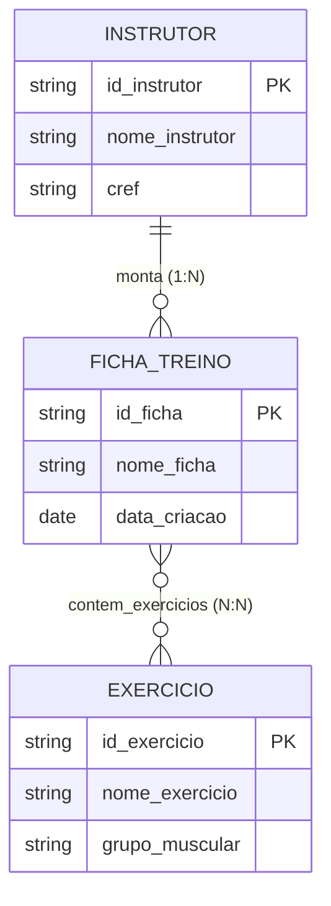

# Sistema Ficha Treino - MongoDB

## Modelo ER



## PowerShell

### Baixar imagem MongoDB para o docker
```bash
docker pull mongodb/mongodb-community-server:latest
```

### Criar container "mongodb"
```bash
docker run --name mongodb -p 27017:27017 -d mongodb/mongodb-community-server:latest
```

## Terminal Docker

### Carregar o interpretador de comandos do Mongo
```bash
mongosh --port 27017
```

## Versão 1: Embedded Relationships

### Criar versão 1
```bash
use versao1
```

### Criar coleção fichas de forma embedded
```bash
db.createCollection("fichas")
```

### Inserir dados
```bash
db.fichas.insert({
	"id_ficha": 1,
	"nome_ficha": "Treino1",
	"data_criacao": "05/06/26",
	"instrutor": {
		"id_instrutor": 1,
		"nome_instrutor": "Daniel",
		"cref": "CREF 000000"
	},
	"exercicios": [
	{
		"id_exercicio": 1,
		"nome_exercicio": "Supino",
		"grupo_muscular": "peito"
	},
	{
		"id_exercicio": 2,
		"nome_exercicio": "Puxada",
		"grupo_muscular": "costa"
	}
	]
})

db.fichas.insert({
	"id_ficha": 2,
	"nome_ficha": "Treino2",
	"data_criacao": "05/06/26",
	"instrutor": {
		"id_instrutor": 1,
		"nome_instrutor": "Daniel",
		"cref": "CREF 000000"
	},
	"exercicios": [
	{
		"id_exercicio": 3,
		"nome_exercicio": "LegPress",
		"grupo_muscular": "perna"
	}
	]
})
```

### Consulta 1 (N:N)
```bash
db.fichas.find(
  { "exercicios.nome_exercicio": "Supino" },
);
```

### Consulta 2 (1:N)
```bash
db.fichas.find(
  { "instrutor.nome_instrutor": "Daniel" },
);
```

## Versão 2: Referenced Relationships
