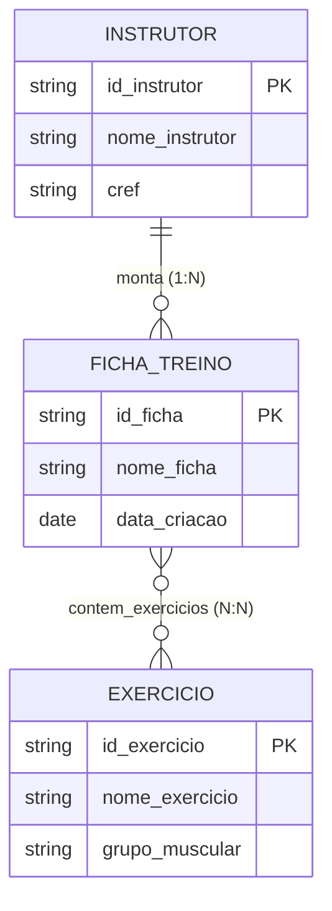

# Sistema Ficha Treino - MongoDB



## PowerShell

### Baixar imagem MongoDB para o docker
```bash
docker pull mongodb/mongodb-community-server:latest
```

### Criar container "mongodb"
```bash
docker run --name mongodb -p 27017:27017 -d mongodb/mongodb-community-server:latest
```
##
## Terminal Docker

### Carregar o interpretador de comandos do Mongo
```bash
mongosh --port 27017
```
